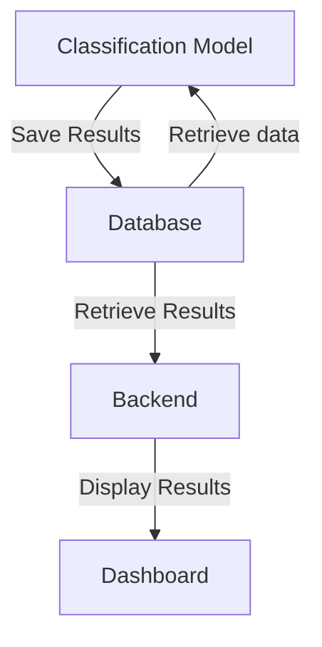
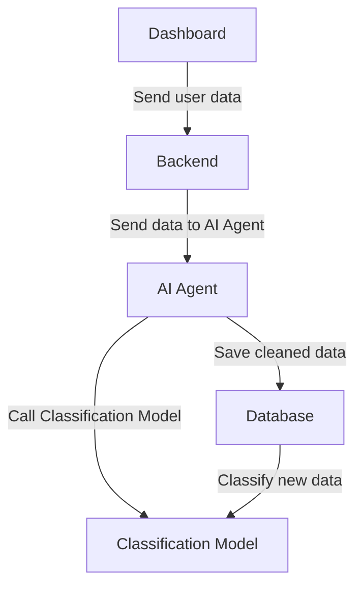

# AI Agent Oil Analysis

> **Note:** This project is under active development and not ready for production use.

AI Agent Oil Analysis is a proof-of-concept dashboard leveraging generative AI for oil data cleaning, preprocessing, and classification. Built with Streamlit, DuckDB, and a custom classification model, it demonstrates the potential of AI-driven workflows in industrial data analysis.

## Features

- Interactive Streamlit dashboard for data exploration
- Automated data cleaning and preprocessing using generative AI
- Custom classification model for oil analysis
- DuckDB integration for efficient data storage and retrieval
- Support for user-uploaded CSV/Excel files

## Project Structure

- `app.py` — Main Streamlit application and dashboard logic
- `data_sampler.py` — Sample data generator for development/testing
- `src/model.py` — Custom classification model and preprocessing helpers
- `src/agent.py` — Implements the generative AI agent responsible for data cleaning, preprocessing, and integration with the classification model

## Setup (Using UV)

1. Clone the repository.
2. Install dependencies:
   ```bash
   uv sync
   ```
3. Generate sample data:
    ```bash
    uv run data_sapler.py mode=clean 
    ```
3. Run the app:
   ```bash
   streamlit run app.py
   ```

## Workflow Diagrams

### Normal Workflow



### Generative AI Workflow (User Upload)



---
*For questions or insights, please open an issue.*