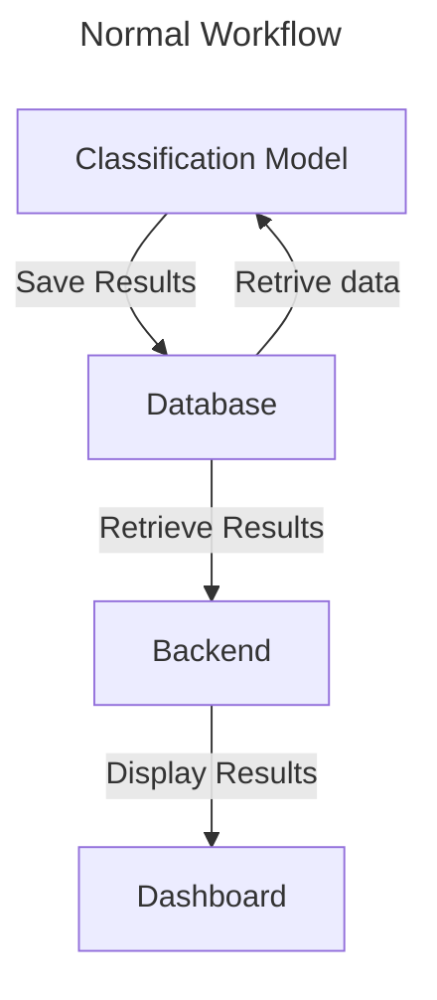
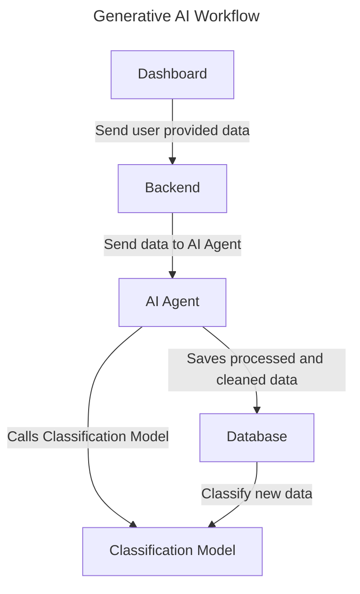

# AI Agent Oil 
> ***Note**: This project is still in development and is not ready for use.*

This project is a proof of concept for a generative AI powered oil analysis dashboard. It is built using Streamlit, DuckDB, and a custom classification model. The project is designed to showcase the potential of generative AI in data cleaning and preprocessing.

## Project Structure
The project is structured as follows:

- `app.py`: The main application file that sets up the Streamlit dashboard and handles user interactions.
- `src/model.py`: Contains the custom classification model and helper functions for data preprocessing.
- `data/clean_data_generator.py`: Generates a sample dataset for testing and development purposes.

## Workflow Diagrams
Below are two diagrams illustrating the different stages of the project's workflow. The first diagram shows the normal workflow, where the user interacts with the dashboard and the just fetches the data preprocessed from the database.

The second diagram shows the workflow when the user uploads a CSV or Excel file containing the data to be analyzed. The file is then cleaned and processed by the AI Agent, which sends the cleaned data, in the correct format to the database for further analysis.

After the data is processed, the classification model is called to classify the new data. The results are then saved to the database and displayed in the dashboard.

